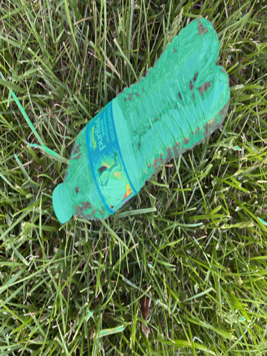

# **TrashApp** 

Segmentation Model (UNET) trained to identify and segment water bottles. 
Goal is to add more classes of trash so that it can identify variety. 
Future Plans to integrate into an IOS app. 

## **Model Results: **

